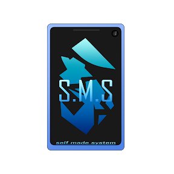

# SelfMadeSystem's Portfolio

<a href="https://shoghisimon.cc/"></a>

## About

This repository has the source code of [my portfolio](https://shoghisimon.cc/). It is a simple website that shows my projects and my contact information.

## Technologies

The website was made using the following technologies:

- [HTML](https://developer.mozilla.org/en-US/docs/Web/HTML)
- [SCSS](https://sass-lang.com/)
- [TypeScript](https://www.typescriptlang.org/)
- [Lit](https://lit.dev/)
- [Vite](https://vitejs.dev/)
- [UnoCSS](https://unocss.com/)
- [Prettier](https://prettier.io/)
- [ESLint](https://eslint.org/)

It's hosted on [Cloudflare Pages](https://pages.dev/).

## How to run

To run the website locally, you need to have [Node.js](https://nodejs.org/) installed. Then, you can run the following commands:

```bash
npm install
npm run dev
```

## License

This project is licensed under the [Apache 2.0 License](./LICENSE).
